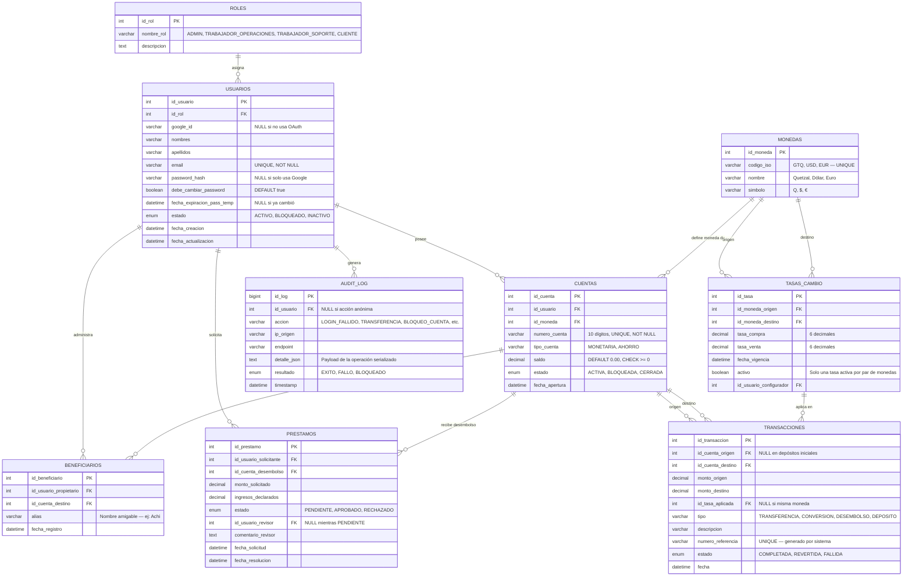
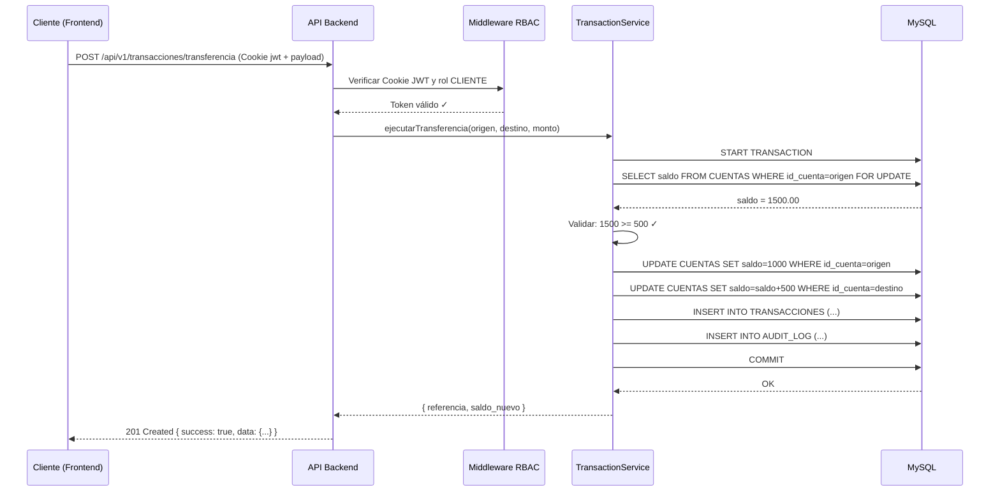

---

# 3. Documento de Diseño del Sistema (DDS) - DigiBank MVP
**Versión:** 2.0 | **Última actualización:** 03/07/2026

---

## 1. Diagrama de Arquitectura

```text
[ NAVEGADOR DEL CLIENTE ]
       | (HTTPS + WSS)
       v
+---------------------------------------------------+
|           FRONTEND (React.js + Tailwind CSS)      | -> Vercel (CDN)
| - SPA con React Router                            |
| - Gestión de estado con Context API               |
| - Interceptores Axios (JWT en headers)            |
| - Cliente Socket.io para el Foro                  |
+---------------------------------------------------+
       | (JSON + JWT en Authorization header)
       v
+---------------------------------------------------+
|         BACKEND (Node.js + Express)               | -> Render / Railway
| - API RESTful con versionado /api/v1/             |
| - Helmet.js (headers de seguridad)                |
| - express-rate-limit (protección DDoS)            |
| - express-validator (sanitización)                |
| - Middlewares RBAC por rol                        |
| - Servidor Socket.io para Foro                    |
| - Winston logger (logging estructurado)           |
+---------------------------------------------------+
       |                                |
 (Transacciones ACID)             (Documentos)
       v                                v
+----------------------+   +------------------------+
|  MySQL 8.x  (3FN)    |   |    MongoDB             |
| - ROLES              |   | - mensajes_foro        |
| - USUARIOS           |   +------------------------+
| - CUENTAS            |
| - MONEDAS            |
| - TASAS_CAMBIO       |
| - TRANSACCIONES      |
| - PRESTAMOS          |
| - BENEFICIARIOS      |
| - AUDIT_LOG          |
+----------------------+
```

---

## 2. Diseño de Base de Datos en Tercera Forma Normal (3FN)

> **3FN garantiza:** (1) No hay grupos repetitivos (1FN). (2) Todo atributo no-clave depende de toda la clave primaria (2FN). (3) No hay dependencias transitivas entre atributos no-clave (3FN).

### Diagrama Entidad-Relación Completo



### Script SQL Completo (MySQL 8.x) — Tercera Forma Normal

```sql
-- =====================================================
-- ESQUEMA DIGIBANK MVP - MySQL 8.x (Tercera Forma Normal)
-- =====================================================

CREATE DATABASE IF NOT EXISTS digibank_mvp CHARACTER SET utf8mb4 COLLATE utf8mb4_unicode_ci;
USE digibank_mvp;

-- Tabla: ROLES
CREATE TABLE ROLES (
    id_rol INT AUTO_INCREMENT PRIMARY KEY,
    nombre_rol VARCHAR(50) NOT NULL UNIQUE,
    descripcion TEXT,
    INDEX idx_nombre_rol (nombre_rol)
) ENGINE=InnoDB;

INSERT INTO ROLES (nombre_rol, descripcion) VALUES
('ADMIN', 'Administrador con acceso total al sistema'),
('TRABAJADOR_OPERACIONES', 'Trabajador que revisa y aprueba préstamos'),
('TRABAJADOR_SOPORTE', 'Trabajador de soporte con acceso de solo lectura'),
('CLIENTE', 'Usuario final del banco');

-- Tabla: USUARIOS
CREATE TABLE USUARIOS (
    id_usuario INT AUTO_INCREMENT PRIMARY KEY,
    id_rol INT NOT NULL,
    google_id VARCHAR(255) NULL UNIQUE,
    nombres VARCHAR(100) NOT NULL,
    apellidos VARCHAR(100) NOT NULL,
    email VARCHAR(255) NOT NULL UNIQUE,
    password_hash VARCHAR(255) NULL,
    debe_cambiar_password BOOLEAN DEFAULT TRUE,
    fecha_expiracion_pass_temp DATETIME NULL,
    estado ENUM('ACTIVO', 'BLOQUEADO', 'INACTIVO') DEFAULT 'ACTIVO',
    fecha_creacion DATETIME DEFAULT CURRENT_TIMESTAMP,
    fecha_actualizacion DATETIME DEFAULT CURRENT_TIMESTAMP ON UPDATE CURRENT_TIMESTAMP,
    FOREIGN KEY (id_rol) REFERENCES ROLES(id_rol) ON DELETE RESTRICT,
    INDEX idx_email (email),
    INDEX idx_estado (estado)
) ENGINE=InnoDB;

-- Tabla: MONEDAS
CREATE TABLE MONEDAS (
    id_moneda INT AUTO_INCREMENT PRIMARY KEY,
    codigo_iso VARCHAR(3) NOT NULL UNIQUE,
    nombre VARCHAR(50) NOT NULL,
    simbolo VARCHAR(5) NOT NULL,
    INDEX idx_codigo_iso (codigo_iso)
) ENGINE=InnoDB;

INSERT INTO MONEDAS (codigo_iso, nombre, simbolo) VALUES
('GTQ', 'Quetzal Guatemalteco', 'Q'),
('USD', 'Dólar Estadounidense', '$'),
('EUR', 'Euro', '€');

-- Tabla: TASAS_CAMBIO
-- NOTA DE DISEÑO: No usamos UNIQUE en (origen, destino) porque necesitamos
-- mantener historial de tasas anteriores para auditoría de conversiones.
-- El campo `activo` garantiza que solo exista UNA tasa vigente por par de monedas.
-- Al actualizar una tasa: primero UPDATE activo=FALSE al registro anterior,
-- luego INSERT del nuevo registro con activo=TRUE.
CREATE TABLE TASAS_CAMBIO (
    id_tasa INT AUTO_INCREMENT PRIMARY KEY,
    id_moneda_origen INT NOT NULL,
    id_moneda_destino INT NOT NULL,
    tasa_compra DECIMAL(10, 6) NOT NULL CHECK (tasa_compra > 0),
    tasa_venta DECIMAL(10, 6) NOT NULL CHECK (tasa_venta > 0),
    activo BOOLEAN NOT NULL DEFAULT TRUE,
    fecha_vigencia DATETIME DEFAULT CURRENT_TIMESTAMP,
    id_usuario_configurador INT NULL,
    FOREIGN KEY (id_moneda_origen) REFERENCES MONEDAS(id_moneda) ON DELETE RESTRICT,
    FOREIGN KEY (id_moneda_destino) REFERENCES MONEDAS(id_moneda) ON DELETE RESTRICT,
    FOREIGN KEY (id_usuario_configurador) REFERENCES USUARIOS(id_usuario) ON DELETE SET NULL,
    INDEX idx_par_activo (id_moneda_origen, id_moneda_destino, activo),
    INDEX idx_vigencia (fecha_vigencia)
) ENGINE=InnoDB;

-- Tabla: CUENTAS
CREATE TABLE CUENTAS (
    id_cuenta INT AUTO_INCREMENT PRIMARY KEY,
    id_usuario INT NOT NULL,
    id_moneda INT NOT NULL,
    numero_cuenta VARCHAR(10) NOT NULL UNIQUE,
    tipo_cuenta VARCHAR(50) NOT NULL DEFAULT 'MONETARIA',
    saldo DECIMAL(15, 2) NOT NULL DEFAULT 0.00 CHECK (saldo >= 0),
    estado ENUM('ACTIVA', 'BLOQUEADA', 'CERRADA') DEFAULT 'ACTIVA',
    fecha_apertura DATETIME DEFAULT CURRENT_TIMESTAMP,
    FOREIGN KEY (id_usuario) REFERENCES USUARIOS(id_usuario) ON DELETE RESTRICT,
    FOREIGN KEY (id_moneda) REFERENCES MONEDAS(id_moneda) ON DELETE RESTRICT,
    INDEX idx_usuario (id_usuario),
    INDEX idx_numero_cuenta (numero_cuenta),
    INDEX idx_estado (estado)
) ENGINE=InnoDB;

-- Tabla: TRANSACCIONES
CREATE TABLE TRANSACCIONES (
    id_transaccion INT AUTO_INCREMENT PRIMARY KEY,
    id_cuenta_origen INT NULL,
    id_cuenta_destino INT NOT NULL,
    monto_origen DECIMAL(15, 2) NOT NULL CHECK (monto_origen > 0),
    monto_destino DECIMAL(15, 2) NOT NULL CHECK (monto_destino > 0),
    id_tasa_aplicada INT NULL,
    tipo ENUM('TRANSFERENCIA', 'CONVERSION', 'DESEMBOLSO', 'DEPOSITO') NOT NULL,
    descripcion VARCHAR(500) NULL,
    numero_referencia VARCHAR(20) NOT NULL UNIQUE,
    estado ENUM('COMPLETADA', 'REVERTIDA', 'FALLIDA') DEFAULT 'COMPLETADA',
    fecha DATETIME DEFAULT CURRENT_TIMESTAMP,
    FOREIGN KEY (id_cuenta_origen) REFERENCES CUENTAS(id_cuenta) ON DELETE RESTRICT,
    FOREIGN KEY (id_cuenta_destino) REFERENCES CUENTAS(id_cuenta) ON DELETE RESTRICT,
    FOREIGN KEY (id_tasa_aplicada) REFERENCES TASAS_CAMBIO(id_tasa) ON DELETE SET NULL,
    INDEX idx_cuenta_origen (id_cuenta_origen),
    INDEX idx_cuenta_destino (id_cuenta_destino),
    INDEX idx_fecha (fecha),
    INDEX idx_referencia (numero_referencia)
) ENGINE=InnoDB;

-- Tabla: PRESTAMOS
CREATE TABLE PRESTAMOS (
    id_prestamo INT AUTO_INCREMENT PRIMARY KEY,
    id_usuario_solicitante INT NOT NULL,
    id_cuenta_desembolso INT NOT NULL,
    monto_solicitado DECIMAL(15, 2) NOT NULL CHECK (monto_solicitado > 0),
    ingresos_declarados DECIMAL(15, 2) NOT NULL CHECK (ingresos_declarados > 0),
    estado ENUM('PENDIENTE', 'APROBADO', 'RECHAZADO') DEFAULT 'PENDIENTE',
    id_usuario_revisor INT NULL,
    comentario_revisor TEXT NULL,
    fecha_solicitud DATETIME DEFAULT CURRENT_TIMESTAMP,
    fecha_resolucion DATETIME NULL,
    FOREIGN KEY (id_usuario_solicitante) REFERENCES USUARIOS(id_usuario) ON DELETE RESTRICT,
    FOREIGN KEY (id_cuenta_desembolso) REFERENCES CUENTAS(id_cuenta) ON DELETE RESTRICT,
    FOREIGN KEY (id_usuario_revisor) REFERENCES USUARIOS(id_usuario) ON DELETE SET NULL,
    INDEX idx_estado (estado),
    INDEX idx_solicitante (id_usuario_solicitante)
) ENGINE=InnoDB;

-- Tabla: BENEFICIARIOS
CREATE TABLE BENEFICIARIOS (
    id_beneficiario INT AUTO_INCREMENT PRIMARY KEY,
    id_usuario_propietario INT NOT NULL,
    id_cuenta_destino INT NOT NULL,
    alias VARCHAR(100) NOT NULL,
    fecha_registro DATETIME DEFAULT CURRENT_TIMESTAMP,
    FOREIGN KEY (id_usuario_propietario) REFERENCES USUARIOS(id_usuario) ON DELETE CASCADE,
    FOREIGN KEY (id_cuenta_destino) REFERENCES CUENTAS(id_cuenta) ON DELETE CASCADE,
    UNIQUE KEY unique_beneficiario (id_usuario_propietario, id_cuenta_destino),
    INDEX idx_propietario (id_usuario_propietario)
) ENGINE=InnoDB;

-- Tabla: AUDIT_LOG (inmutable — no se actualiza ni elimina)
CREATE TABLE AUDIT_LOG (
    id_log BIGINT AUTO_INCREMENT PRIMARY KEY,
    id_usuario INT NULL,
    accion VARCHAR(100) NOT NULL,
    ip_origen VARCHAR(45) NOT NULL,
    endpoint VARCHAR(255) NOT NULL,
    detalle_json JSON NULL,
    resultado ENUM('EXITO', 'FALLO', 'BLOQUEADO') NOT NULL,
    timestamp DATETIME DEFAULT CURRENT_TIMESTAMP,
    FOREIGN KEY (id_usuario) REFERENCES USUARIOS(id_usuario) ON DELETE SET NULL,
    INDEX idx_usuario (id_usuario),
    INDEX idx_accion (accion),
    INDEX idx_timestamp (timestamp)
) ENGINE=InnoDB;

-- Tabla: SESIONES_REVOCADAS
-- Permite invalidar JWTs antes de que expiren (logout, cambio de contraseña, bloqueo de cuenta).
-- El campo `expira_en` permite limpiar registros vencidos con un cron job diario
-- (DELETE FROM SESIONES_REVOCADAS WHERE expira_en < NOW()).
CREATE TABLE SESIONES_REVOCADAS (
    id INT AUTO_INCREMENT PRIMARY KEY,
    token_jti VARCHAR(36) NOT NULL UNIQUE,   -- UUID del claim `jti` del JWT
    id_usuario INT NOT NULL,
    motivo VARCHAR(100) NOT NULL,            -- LOGOUT, CAMBIO_PASSWORD, CUENTA_BLOQUEADA
    revocado_en DATETIME DEFAULT CURRENT_TIMESTAMP,
    expira_en DATETIME NOT NULL,             -- Copia del `exp` del JWT para limpieza automática
    FOREIGN KEY (id_usuario) REFERENCES USUARIOS(id_usuario) ON DELETE CASCADE,
    INDEX idx_jti (token_jti),
    INDEX idx_expira (expira_en)
) ENGINE=InnoDB;
```

### Colecciones MongoDB

```javascript
// Colección: mensajes_foro
{
  _id: ObjectId,
  id_usuario: Number,        // FK lógica al id_usuario de MySQL
  nombre_usuario: String,    // Desnormalizado para rendimiento de lectura
  avatar_url: String,        // URL del avatar de Google
  mensaje: String,           // Contenido del mensaje (max 1000 chars)
  timestamp: Date,           // Fecha de envío
  editado: Boolean,          // Si fue editado
  fecha_edicion: Date        // NULL si no fue editado
}

// Índices recomendados en MongoDB
db.mensajes_foro.createIndex({ timestamp: -1 });   // Mensajes recientes primero
db.mensajes_foro.createIndex({ id_usuario: 1 });   // Buscar mensajes de un usuario
```

---

## 3. Contrato de API REST (OpenAPI 3.0)

> Todos los endpoints (excepto los públicos) requieren el JWT en una cookie HttpOnly llamada `jwt` enviada automáticamente en las peticiones.
> 
> *Nota sobre desarrollo:* Para el desarrollo local en `localhost` bajo HTTP, el flag `secure` de la cookie debe configurarse como `false` en el entorno, pero en producción (Vercel/Render) sobre HTTPS debe ser `secure: true`.

### Endpoints Públicos

#### `POST /api/v1/auth/login`
**Descripción:** Autentica al usuario con email y contraseña. Establece el JWT en una cookie HttpOnly (`Set-Cookie: jwt=<token>; HttpOnly; SameSite=Strict; Path=/; Max-Age=900`).

**Request Body:**
```json
{
  "email": "string (email válido, requerido)",
  "password": "string (min 8 chars, requerido)"
}
```

**Response 200 OK:**
```json
{
  "success": true,
  "data": {
    "usuario": {
      "id_usuario": 1,
      "nombres": "Carlos",
      "apellidos": "García",
      "email": "carlos@digibank.com",
      "rol": "CLIENTE",
      "debe_cambiar_password": false
    }
  }
}
```

**Response 401 Unauthorized:**
```json
{
  "success": false,
  "error": {
    "code": "INVALID_CREDENTIALS",
    "message": "Email o contraseña incorrectos"
  }
}
```

**Response 423 Locked:**
```json
{
  "success": false,
  "error": {
    "code": "ACCOUNT_LOCKED",
    "message": "Cuenta bloqueada por seguridad. Contacte soporte."
  }
}
```

---

#### `POST /api/v1/auth/logout`
**Descripción:** Invalida la sesión activa del usuario eliminando la cookie JWT y revocando el token en el backend. La revocación del JWT se implementa mediante la tabla `SESIONES_REVOCADAS` en MySQL para el MVP (deuda técnica a migrar a Redis en producción).

**Headers requeridos:** Ninguno (se lee de la cookie `jwt`)

**Response 200 OK:**
```json
{
  "success": true,
  "message": "Sesión cerrada correctamente"
}
```

**Implementación en el middleware de auth:**
```javascript
// Antes de validar el JWT, verificar que no esté revocado
const revocado = await db.execute(
  'SELECT id FROM SESIONES_REVOCADAS WHERE token_jti = ? AND expira_en > NOW()',
  [decoded.jti]
);
if (revocado[0].length > 0) return res.status(401).json({ error: 'TOKEN_REVOKED' });
```

> **Nota:** El JWT debe incluir el claim `jti` (JWT ID único) para poder identificarlo en la lista de revocación. Agregar al generar el token: `jti: crypto.randomUUID()`.

---

#### `PATCH /api/v1/auth/cambiar-password`
**Descripción:** Cambia la contraseña del usuario autenticado. Obligatorio en el primer login.

**Headers requeridos:** `Authorization: Bearer <token>`

**Request Body:**
```json
{
  "password_actual": "DigiBank-k9p2",
  "password_nueva": "MiNuevaContraseña123!",
  "password_confirmacion": "MiNuevaContraseña123!"
}
```

**Validaciones del servidor:**
- `password_nueva` debe tener mínimo 8 caracteres, al menos 1 mayúscula, 1 número y 1 carácter especial
- `password_nueva !== password_actual` (no puede reutilizar la temporal)
- `password_nueva === password_confirmacion`

**Response 200 OK:**
```json
{
  "success": true,
  "message": "Contraseña actualizada correctamente"
}
```

**Response 400 Bad Request:**
```json
{
  "success": false,
  "error": {
    "code": "WEAK_PASSWORD",
    "message": "La contraseña debe tener mínimo 8 caracteres, una mayúscula, un número y un símbolo."
  }
}
```

---
**Descripción:** Autentica al usuario con Google OAuth2.

**Request Body:**
```json
{
  "google_token": "string (ID Token de Google, requerido)"
}
```

**Response:** Igual estructura que `/auth/login`.

---

#### `GET /api/v1/tasas-cambio`
**Descripción:** Devuelve las tasas de cambio vigentes (público con rate limiting).

**Response 200 OK:**
```json
{
  "success": true,
  "data": {
    "USD": {
      "compra": 7.39,
      "venta": 7.77,
      "simbolo": "$"
    },
    "EUR": {
      "compra": 8.05,
      "venta": 8.45,
      "simbolo": "€"
    }
  },
  "timestamp": "2026-07-03T10:30:00Z"
}
```

**Response 429 Too Many Requests:**
```json
{
  "success": false,
  "error": {
    "code": "RATE_LIMIT_EXCEEDED",
    "message": "Demasiadas peticiones. Intente en 60 segundos."
  }
}
```

### Endpoints del Cliente (Rol: CLIENTE)

#### `GET /api/v1/cuentas/mis-cuentas`
**Response 200 OK:**
```json
{
  "success": true,
  "data": [
    {
      "id_cuenta": 1,
      "numero_cuenta": "3850060904",
      "tipo_cuenta": "MONETARIA",
      "moneda": "GTQ",
      "simbolo": "Q",
      "saldo": 1500.00,
      "estado": "ACTIVA"
    }
  ]
}
```

---

#### `POST /api/v1/transacciones/transferencia`
**Descripción:** Transferencia atómica ACID entre dos cuentas del mismo banco y misma moneda.

**Request Body:**
```json
{
  "id_cuenta_origen": 1,
  "numero_cuenta_destino": "8492018492",
  "monto": 500.00,
  "descripcion": "Pago de deuda"
}
```

**Response 201 Created:**
```json
{
  "success": true,
  "data": {
    "numero_referencia": "TXN-20260703-88934",
    "monto": 500.00,
    "moneda": "GTQ",
    "saldo_resultante_origen": 1000.00,
    "fecha": "2026-07-03T14:25:00Z",
    "estado": "COMPLETADA"
  }
}
```

**Response 422 Unprocessable Entity:**
```json
{
  "success": false,
  "error": {
    "code": "INSUFFICIENT_FUNDS",
    "message": "Saldo insuficiente en la cuenta de origen"
  }
}
```

---

#### `POST /api/v1/transacciones/conversion`
**Descripción:** Convierte dinero entre dos cuentas propias del mismo cliente con distinta moneda.

**Request Body:**
```json
{
  "id_cuenta_origen": 1,
  "id_cuenta_destino": 2,
  "monto_origen": 779.00
}
```

**Response 201 Created:**
```json
{
  "success": true,
  "data": {
    "numero_referencia": "CVN-20260703-00412",
    "monto_origen": 779.00,
    "moneda_origen": "GTQ",
    "monto_destino": 100.00,
    "moneda_destino": "USD",
    "tasa_aplicada": 7.79,
    "tipo_tasa": "VENTA",
    "fecha": "2026-07-03T14:30:00Z"
  }
}
```

---

#### `GET /api/v1/transacciones/historial`
**Descripción:** Historial paginado de movimientos del cliente autenticado.

**Query params:**
- `id_cuenta` (requerido): ID de la cuenta a consultar
- `page` (opcional, default: 1)
- `limit` (opcional, default: 20, máx: 50)
- `fecha_inicio` (opcional): `YYYY-MM-DD`
- `fecha_fin` (opcional): `YYYY-MM-DD`
- `tipo` (opcional): `TRANSFERENCIA | CONVERSION | DESEMBOLSO`

**Response 200 OK:**
```json
{
  "success": true,
  "data": {
    "transacciones": [
      {
        "id_transaccion": 101,
        "numero_referencia": "TXN-20260703-88934",
        "fecha": "2026-07-03T14:25:00Z",
        "tipo": "TRANSFERENCIA",
        "descripcion": "Pago de deuda",
        "monto": -500.00,
        "moneda": "GTQ",
        "saldo_resultante": 1000.00,
        "tipo_operacion": "DEBITO"
      }
    ],
    "paginacion": {
      "pagina_actual": 1,
      "total_paginas": 5,
      "total_registros": 98,
      "registros_por_pagina": 20
    }
  }
}
```

---

#### `POST /api/v1/prestamos/solicitar`
**Request Body:**
```json
{
  "id_cuenta_desembolso": 1,
  "monto_solicitado": 5000.00,
  "ingresos_declarados": 8000.00
}
```

**Response 201 Created:**
```json
{
  "success": true,
  "data": {
    "id_prestamo": 42,
    "monto_solicitado": 5000.00,
    "estado": "PENDIENTE",
    "fecha_solicitud": "2026-07-03T09:00:00Z"
  }
}
```

### Endpoints del Trabajador de Operaciones

#### `GET /api/v1/trabajador/prestamos`
**Response 200 OK:**
```json
{
  "success": true,
  "data": [
    {
      "id_prestamo": 42,
      "solicitante": {
        "id_usuario": 5,
        "nombre_completo": "Carlos García",
        "email": "carlos@example.com"
      },
      "monto_solicitado": 5000.00,
      "ingresos_declarados": 8000.00,
      "ratio_deuda_ingreso": 0.625,
      "saldo_promedio_cuenta": 1200.00,
      "estado": "PENDIENTE",
      "fecha_solicitud": "2026-07-03T09:00:00Z"
    }
  ]
}
```

---

#### `POST /api/v1/trabajador/prestamos/:id_prestamo/resolver`
**Request Body:**
```json
{
  "decision": "APROBADO",
  "comentario_revisor": "Cliente cumple con el ratio de ingresos. Aprobado."
}
```

**Response 200 OK:**
```json
{
  "success": true,
  "data": {
    "id_prestamo": 42,
    "estado": "APROBADO",
    "numero_referencia_desembolso": "DSB-20260703-00001",
    "monto_desembolsado": 5000.00,
    "fecha_resolucion": "2026-07-03T11:45:00Z"
  }
}
```

### Endpoints del Administrador

#### `POST /api/v1/admin/usuarios`
**Request Body:**
```json
{
  "nombres": "María",
  "apellidos": "López",
  "email": "maria@digibank.com",
  "rol": "CLIENTE",
  "monedas_cuentas": ["GTQ", "USD"]
}
```

**Response 201 Created:**
```json
{
  "success": true,
  "data": {
    "id_usuario": 10,
    "email": "maria@digibank.com",
    "cuentas_generadas": [
      { "numero_cuenta": "4729183650", "moneda": "GTQ" },
      { "numero_cuenta": "8302947561", "moneda": "USD" }
    ],
    "password_temporal": "DigiBank-k9p2",
    "expira_en": "2026-07-04T12:00:00Z"
  }
}
```

#### `PUT /api/v1/admin/tasas-cambio`
**Request Body:**
```json
{
  "USD": { "compra": 7.39, "venta": 7.77 },
  "EUR": { "compra": 8.05, "venta": 8.45 }
}
```

**Response 200 OK:**
```json
{
  "success": true,
  "data": {
    "tasas_actualizadas": 2,
    "fecha_vigencia": "2026-07-03T08:00:00Z"
  }
}
```

### Tabla Resumen de Endpoints

| Método | Endpoint | Rol requerido | Descripción |
|--------|----------|---------------|-------------|
| POST | `/api/v1/auth/login` | Público | Login local |
| POST | `/api/v1/auth/google` | Público | Login con Google |
| POST | `/api/v1/auth/logout` | Autenticado | Cierre de sesión y revocación de JWT |
| PATCH | `/api/v1/auth/cambiar-password` | Autenticado | Cambio de contraseña (obligatorio 1er login) |
| GET | `/api/v1/tasas-cambio` | Público | Tasas de cambio vigentes |
| GET | `/api/v1/cuentas/mis-cuentas` | CLIENTE | Mis cuentas |
| POST | `/api/v1/transacciones/transferencia` | CLIENTE | Transferir a tercero (misma moneda) |
| POST | `/api/v1/transacciones/conversion` | CLIENTE | Convertir entre mis cuentas (distinta moneda) |
| GET | `/api/v1/transacciones/historial` | CLIENTE | Historial paginado |
| GET | `/api/v1/reportes/estado-cuenta` | CLIENTE | Descargar PDF con rango de fechas |
| POST | `/api/v1/prestamos/solicitar` | CLIENTE | Solicitar préstamo |
| GET | `/api/v1/prestamos/mis-prestamos` | CLIENTE | Estado de mis solicitudes |
| GET | `/api/v1/beneficiarios` | CLIENTE | Listar beneficiarios |
| POST | `/api/v1/beneficiarios` | CLIENTE | Agregar beneficiario |
| DELETE | `/api/v1/beneficiarios/:id` | CLIENTE | Eliminar beneficiario |
| GET | `/api/v1/soporte/clientes/:num_cuenta` | TRAB_SOPORTE | Buscar cliente (solo lectura) |
| POST | `/api/v1/soporte/cuentas/:id/bloquear` | TRAB_SOPORTE | Bloquear cuenta |
| GET | `/api/v1/trabajador/prestamos` | TRAB_OPERACIONES | Cola de préstamos pendientes |
| POST | `/api/v1/trabajador/prestamos/:id/resolver` | TRAB_OPERACIONES | Aprobar o rechazar préstamo |
| POST | `/api/v1/admin/usuarios` | ADMIN | Crear usuario (cliente o trabajador) |
| PUT | `/api/v1/admin/tasas-cambio` | ADMIN | Actualizar tasas de cambio |
| GET | `/api/v1/admin/audit-log` | ADMIN | Ver logs de auditoría |

---

## 4. Diagrama de Flujo — Transferencia ACID



---

## 5. Arquitectura de Seguridad

### Headers HTTP (helmet.js)
```javascript
app.use(helmet({
  contentSecurityPolicy: {
    directives: {
      defaultSrc: ["'self'"],
      scriptSrc: ["'self'", "https://accounts.google.com"],
      connectSrc: ["'self'", process.env.FRONTEND_URL]
    }
  },
  hsts: { maxAge: 31536000, includeSubDomains: true },
  frameguard: { action: 'deny' },
  noSniff: true
}));
```

### Rate Limiting (express-rate-limit)
```javascript
// Autenticación: 5 intentos / 15 minutos por IP
const authLimiter = rateLimit({
  windowMs: 15 * 60 * 1000,
  max: 5,
  message: { code: 'RATE_LIMIT_EXCEEDED', message: 'Demasiados intentos' }
});

// API pública: 60 req/min por IP
const publicLimiter = rateLimit({ windowMs: 60000, max: 60 });

// API transaccional: 10 req/min por usuario
const transactionalLimiter = rateLimit({
  windowMs: 60000,
  max: 10,
  keyGenerator: (req) => req.user?.id_usuario || req.ip
});
```

### Algoritmo de Generación de Cuentas (Luhn)
```javascript
// ─── luhn.js ───────────────────────────────────────────────────────────────
// Calcula el dígito verificador de Luhn para una cadena numérica de N dígitos.
// Retorna el dígito (0-9) que al agregar al final hace que el total Luhn % 10 === 0.
function calcularDigitoLuhn(numeroSinVerificador) {
  const digits = numeroSinVerificador.split('').map(Number).reverse();
  let suma = 0;
  for (let i = 0; i < digits.length; i++) {
    let d = digits[i];
    if (i % 2 === 0) {          // posiciones pares (desde la derecha, índice 0)
      d *= 2;
      if (d > 9) d -= 9;
    }
    suma += d;
  }
  return (10 - (suma % 10)) % 10;
}

// Genera número de cuenta de 10 dígitos único con dígito verificador Luhn.
// Estructura: [2 dígitos prefijo banco] + [7 dígitos núcleo aleatorio] + [1 dígito Luhn]
async function generarNumeroCuenta(db, prefijoBanco = '38') {
  let intentos = 0;
  while (intentos < 100) {
    // Núcleo de 7 dígitos aleatorios
    const nucleo = Math.floor(Math.random() * 10_000_000)
      .toString()
      .padStart(7, '0');
    // Base de 9 dígitos (prefijo + núcleo)
    const base9 = prefijoBanco + nucleo;            // longitud: 2 + 7 = 9 ✓
    // Calcular el décimo dígito verificador
    const verificador = calcularDigitoLuhn(base9);  // retorna 0-9
    const numeroCuenta = base9 + verificador;       // longitud: 10 ✓

    const [rows] = await db.execute(
      'SELECT id_cuenta FROM CUENTAS WHERE numero_cuenta = ?',
      [numeroCuenta]
    );
    if (rows.length === 0) return numeroCuenta;
    intentos++;
  }
  throw new Error('No se pudo generar un número de cuenta único tras 100 intentos');
}
```

---

## 6. Wireframes de Pantallas Clave

1. **Landing Page Pública:** Carrusel (Hero Banner) + Widget de tipo de cambio en la barra superior + Modal superpuesto para la Calculadora de Préstamos.

2. **Login Unificado:** Formulario minimalista (email + contraseña) + botón "Continuar con Google". El sistema redirige según el rol del JWT recibido.

3. **Dashboard Cliente:**
   - Top Bar: Precio del dólar del día + Navegación (Resumen | Transferencias | Préstamos | Estados de Cuenta | Foro)
   - Centro: Tarjetas por cuenta (número, moneda, saldo, estado)
   - Acciones rápidas: Transferir, Convertir, Solicitar Préstamo

4. **Modal de Transferencia:** Destino bloqueado (solo lectura), selector "Debitar de", campo de monto, descripción opcional + confirmación doble.

5. **Back-Office Trabajador:** Tabla de préstamos `PENDIENTE` con columnas de ratio de deuda/ingreso + botones Aprobar (verde) / Rechazar (rojo) + modal de comentario obligatorio.

6. **Panel Administrador:** Formulario de creación de usuarios + widget de actualización de tasas de cambio + tabla de AUDIT_LOG con filtros.

---

## 7. Stack Tecnológico Definitivo

| Tecnología | Rol | Justificación |
|------------|-----|---------------|
| **React.js 18 + Vite** | Frontend SPA | Renderizado reactivo, HMR ultrarrápido en desarrollo |
| **Tailwind CSS** | UI Framework | Utilitario, responsive, sin colisiones de estilos |
| **Node.js 20 LTS + Express 4** | Backend API | Event-loop asíncrono, ideal para I/O intensivo |
| **MySQL 8.x (3FN)** | BD Transaccional | ACID nativo, integridad referencial financiera |
| **MongoDB 7** | BD Documental | Flexible para mensajes del foro con TTL opcional |
| **Socket.io 4** | WebSockets | Canal bidireccional con fallback a long-polling |
| **JWT (`jsonwebtoken`) + claim `jti`** | Autenticación | Tokens con ID único para soporte de revocación |
| **bcryptjs** | Hashing | Sin binarios nativos — compatible con Render |
| **SESIONES_REVOCADAS (MySQL)** | Revocación JWT | Invalidación de tokens sin Redis (suficiente para MVP) |
| **Helmet.js** | Seguridad HTTP | Headers de seguridad (CSP, HSTS, X-Frame) en un middleware |
| **express-rate-limit** | Anti-DDoS/Brute-force | Límites por IP y por usuario autenticado |
| **express-validator** | Validación de inputs | Sanitización + validación declarativa en cada endpoint |
| **Winston** | Logging | Logs JSON estructurados, niveles por entorno |
| **pdfkit** | Generación de PDFs | Genera estados de cuenta en Node.js sin dependencias externas |
| **Jest + Supertest** | Testing | Unitario e integración de API sin servidor externo |
| **Artillery** | Testing de carga | Simulación de 100 usuarios concurrentes |
| **Vercel** | Hosting Frontend | CDN global, CI/CD desde Git, soporte Vite nativo |
| **Render** | Hosting Backend | Soporte WebSockets persistentes, variables de entorno seguras |
| **GitHub Actions** | CI/CD | Pipeline lint → test → build antes de cada deploy |

> **Aclaración sobre Python:** El perfil técnico de referencia menciona Python para cálculos financieros y PDFs. Para este MVP se toma la decisión consciente de mantener todo en Node.js (`pdfkit` para PDFs) y evitar la complejidad operativa de un microservicio Python adicional. Si el proyecto escala, los servicios de reportería pueden migrar a un servicio Python/FastAPI con la misma interfaz REST.
